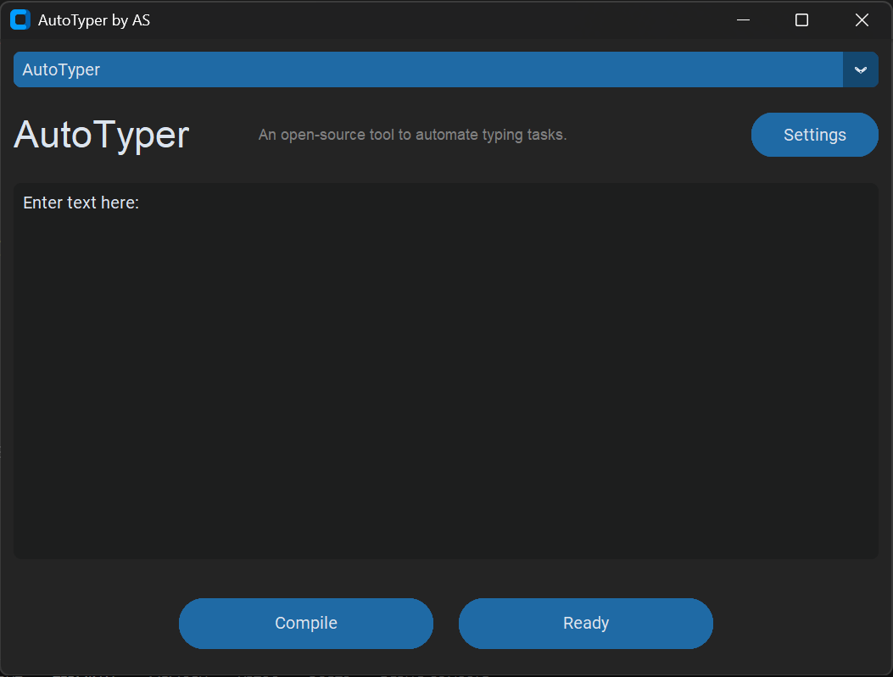
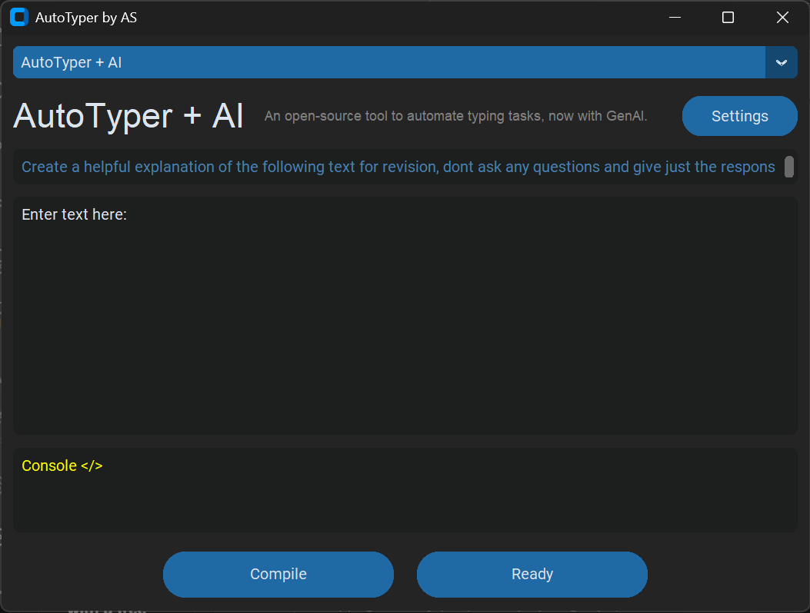

# ✨ AutoTyper by AS ⌨️ + 🧠 (AI Enhanced)

## Description 📝

AutoTyper by AS is an open-source utility developed to automate text entry tasks 🤖 on your computer. It offers two primary operational modes: a standard **AutoTyper** for the automated reproduction of user-defined text and an advanced **AutoTyper + AI** mode that integrates generative artificial intelligence (powered by Ollama 🦙) to process and rephrase textual content prior to automated typing. This dual functionality renders it a versatile tool suitable for a range of applications, from the efficient execution of repetitive data input to the dynamic generation of revised textual material. 🎉

## ✨ Key Features ✨

**Standard AutoTyper Mode ⌨️:**


*This image showcases the modern and intuitive graphical user interface of the AutoTyper application, highlighting the mode selection mechanism, text input fields, operational buttons.*

* **Intuitive Text Input:** Facilitates straightforward entry of text intended for automated typing. ✍️
* **Adjustable Typing Velocity:** Enables user control over the rate at which text is entered. 💨
* **Incorporation of Typing Variance:** Introduces subtle, randomized variations in typing speed to emulate human-like input. 😉
* **Hotkey-Triggered Operation:** Allows for the initiation and termination of the typing process via a configurable hotkey (`Ctrl+#`). 🕹️
* **Clear Operational Status Indication:** Provides real-time feedback on the application's current state (Ready ✅, Typing Text 🔴, Stopped 🟠, Compiled 🟡).
* **User-Configurable Parameters:** Features a dedicated settings interface for adjusting typing speed and randomness levels. ⚙️

**Enhanced AutoTyper + AI Mode 🧠:**


*This image showcases the modern and intuitive graphical user interface of the AutoTyper application, highlighting the mode selection mechanism, text input fields, operational buttons, and the AI output console.*

* **Generative AI Integration (Ollama):** Leverages the Ollama library and a designated language model (`qwen2.5:0.5b` by default) for intelligent text processing. 
* **Contextual Prompting Capability:** Includes a dedicated input field for providing prompts or instructions to guide the AI's processing of the primary text (e.g., "Generate a concise summary of the following text for review purposes:"). 💡
* **Dedicated AI Output Display:** Presents the text generated by the AI model within a specific console area. 👀
* **Automated Typing of AI-Generated Content:** Upon completion of AI processing, the utility automatically types the resulting text. ✨
* **Hotkey-Controlled Activation:** Similar to the standard mode, utilizes `Ctrl+#` to commence and cease the automated typing of AI-processed text. 🕹️
* **Transparent Operational Status:** Offers clear updates on the application's current state. ✅🔴🟠🟡
* **Shared Configuration Settings:** Employs the same settings for typing speed and randomness as the standard mode. ⚙️

## 🚀 Getting Started 🚀

### Prerequisites ✅

* **Python 3.6 or higher:** Ensure that Python is installed on the system. 🐍
* **CustomTkinter Library:** Install for the graphical user interface:
    ```bash
    pip install customtkinter
    ```
* **PyAutoGUI Library:** Install for programmatic control of keyboard and mouse:
    ```bash
    pip install pyautogui
    ```
* **Keyboard Library:** Install for hotkey management:
    ```bash
    pip install keyboard
    ```
* **Ollama (for AutoTyper + AI mode):**
    * Download and install from the official website: [https://ollama.com/download](https://ollama.com/download) 🦙
    * Execute Ollama and retrieve the required language model (e.g., `qwen2.5:0.5b`):
        ```bash
        ollama pull qwen2.5:0.5b
        ```
* **Ollama Python Library (for AutoTyper + AI mode):** Install the Python interface for Ollama:
    ```bash
    pip install ollama
    ```

### Installation Procedure 🛠️

1.  If the code is managed under a version control system, clone the repository:
    ```bash
    git clone <repository_url>
    cd <project_directory>
    ```
2.  Alternatively, save the provided Python code as a `.py` file (e.g., `autotyper.py`). 💾

### Instructions for Use 🕹️

1.  Execute the Python script:
    ```bash
    python autotyper.py
    ```
2.  **Splash Screen:** A brief loading sequence will be displayed. ⏳
3.  **Main User Interface:**
    * **Mode Selection:** Utilize the dropdown menu at the top to choose between "AutoTyper" and "AutoTyper + AI" modes. ⚙️
    * **Text Input:** Enter or paste the text intended for automation into the primary text area. ✍️
    * **AI Prompt (in AI Mode):** When using "AutoTyper + AI", provide instructions to the AI in the smaller text field above the main input. 🤔
    * **Compilation:** Click the "Compile" button to prepare the text for automation (and initiate AI processing in the enhanced mode). The button will indicate compilation by changing to yellow. 🟡
    * **Status Monitoring:** The button located on the right side of the interface displays the current operational status of the application. ✅➡️🔴➡️🟠
    * **AI Console (in AI Mode):** In "AutoTyper + AI" mode, the output generated by the AI will be shown in this dedicated text area. 👀
    * **Settings Adjustment:** Access the "Settings" panel by clicking the respective button to modify typing speed and randomness. Confirm changes by clicking "Return". ⚙️
4.  **Initiating Automated Typing:** Once the text is compiled and the status indicates "Press Keybind", press `Ctrl+#` in the target application window. ✨
5.  **Terminating Automated Typing:** Press `Ctrl+#` again to halt the ongoing typing process. The status will update to "Stopped". 🛑

## ⚙️ Configuration Settings ⚙️

The settings interface allows for customization of the typing behavior:

* **Speed:** Determines the temporal delay (in seconds) between the input of each character. Lower values correspond to faster typing speeds. 💨
* **Randomness:** Introduces a degree of stochastic variation (up to the specified value in seconds) to the base typing speed, thereby simulating more naturalistic typing patterns. 😉

## 🤝 Contributing to the Project 🤝

Contributions to this open-source initiative are highly encouraged. Interested parties are invited to fork the repository, implement enhancements, and submit pull requests. Bug reports and suggestions for new features are also welcome.🙏

I also love to hear about what my work is being used for so please get in contact with me to let me know what your using my project for or how your adapting it for your own use case!


## 📜 Licensing Information 📜

This project is distributed under the terms of the [MIT License]. Refer to the `LICENSE` file for comprehensive licensing details. 📄

## 🙌 Acknowledgements 🙌

* The CustomTkinter library for providing the modern graphical user interface. ✨
* The PyAutoGUI library for enabling programmatic keyboard input. 🧙‍♂️
* The keyboard library for facilitating the use of global hotkeys. ⌨️
* The Ollama project and its Python library for the integration of generative AI capabilities. 🦙🧠
* The Qwen Team for the development of the `qwen2.5:0.5b` language model. 🌟

## 👨‍💻 Project Author 👩‍💻

[Aditya Suresh]
